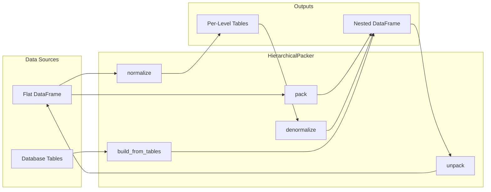

# Hierarchical Data

The `HierarchicalPacker` provides operations for working with hierarchical data structures, similar to how pandas MultiIndex works but using Polars' native nested types (structs and lists).

## The Concept

Consider geographic data with this hierarchy:

```
Country
└── City
    └── Street
```

In a flat representation, this might look like:

**Flat Table Representation**

| country.code | country.city.id | country.city.street.name | country.population | country.city.population | country.city.street.population |
|--------------|----------------|-------------------------|--------------------|------------------------|-------------------------------|
| US           | NYC            | Broadway                | 10000000           | 8000000                | 21.0                          |
| US           | NYC            | 5th Ave                 | 10000000           | 8000000                | 10.0                          |
| US           | LA             | Sunset Blvd             | 10000000           | 4000000                | 35.0                          |
| US           | LA             | Sunset Blvd             | 10000000           | 4000000                | 35.0                          |

**Nested Representation (packed at country level):**

```json
{
  "country": {
    "code": "US",
    "population": 10000000,
    "city": [
      {
        "id": "NYC",
        "population": 8000000,
        "street": [
          {"name": "Broadway", "population": 21.0},
          {"name": "5th Ave", "population": 10.0}
        ]
      },
      {
        "id": "LA",
        "population": 4000000,
        "street": [
          {"name": "Sunset Blvd", "population": 35.0}
        ]
      }
    ]
  }
}
```


The benefit of a nested structure is that multiple granularities can be represented in a single table, unlike standard flat/denormalized data. One current limitation with polars is that operations cannot easily be carried out between different granularities, but using Nexpresso, you can perform operations between different granularities by simply unpacking to your required level, performing your operations, and then packing back.

## Key Operations

### Pack - Aggregate to Coarser Granularity

```python
# From street-level (3 rows) to country-level (1 row)
country_level = packer.pack(flat_df, "country")
```

Packing:

1. Groups rows by parent keys
2. Collects child records into lists
3. Creates nested struct columns

### Unpack - Explode to Finer Granularity

```python
# From country-level (1 row) back to street-level (3 rows)
street_level = packer.unpack(country_level, "street")
```

Unpacking:

1. Explodes list columns
2. Unnests struct columns
3. Prefixes field names appropriately

## Defining a Hierarchy

### Using HierarchySpec

```python
from nexpresso import HierarchySpec, LevelSpec, HierarchicalPacker

spec = HierarchySpec(
    levels=[
        LevelSpec(name="country", id_fields=["code"]),
        LevelSpec(name="city", id_fields=["id"]),
        LevelSpec(name="street", id_fields=["name"]),
    ]
)

packer = HierarchicalPacker(spec)
```

### Using from_levels (for database tables)

```python
spec = HierarchySpec.from_levels(
    LevelSpec(name="country", id_fields=["code"]),
    LevelSpec(name="city", id_fields=["id"], parent_keys=["country_code"]),
    LevelSpec(name="street", id_fields=["name"], parent_keys=["city_id"]),
)
```

The `parent_keys` specify which columns in a child table link to the parent's `id_fields`.

## LevelSpec Options

```python
LevelSpec(
    name="city",           # Level identifier
    id_fields=["id"],      # Columns that uniquely identify records
    required_fields=None,  # Columns that must be non-null
    order_by=None,         # Expressions for ordering children
    parent_keys=None,      # Foreign keys to parent level (for build_from_tables)
    parent=None,           # Parent level name; None = the level declared before
)
```

## Multiple Branches per Level

Real hierarchies are not always a single chain. A city has streets, and streets
have buildings — but a city also has *services* (police, fire, water, medical).
Services are a genuine property of a city and are orthogonal to streets: they
are neither above nor below them.

Give a level an explicit `parent` and it becomes a **tree**:

```python
spec = HierarchySpec.from_levels(
    LevelSpec(name="country",  id_fields=["code"]),
    LevelSpec(name="city",     id_fields=["id"],   parent="country", parent_keys=["code"]),
    LevelSpec(name="street",   id_fields=["id"],   parent="city",    parent_keys=["city_id"]),
    LevelSpec(name="building", id_fields=["id"],   parent="street",  parent_keys=["street_id"]),
    LevelSpec(name="service",  id_fields=["kind"], parent="city",    parent_keys=["city_id"]),
)
```

```
country
  └── city
        ├── street ── building
        └── service
```

`parent` is all-or-nothing: either no level declares it (the spec is read as a
linear chain in declaration order, exactly as before) or every non-root level
declares it. Half-inferring would silently attach `service` to `building` just
because it was declared last.

Packing folds every branch, so a city's struct carries both:

```python
nested.schema["country"]
# Struct({'code': …, 'name': …, 'city': List(Struct({
#     'id': …, 'population': …,
#     'street':  List(Struct({'id': …, 'building': List(Struct({…}))})),
#     'service': List(Struct({'kind': …, 'budget': …})),
# }))})
```

### Axes

The root → level chain is an **axis**. Every level has exactly one — a level has
only one path back to the root even when the tree branches — so column paths
(`country.city.service.kind`) and key propagation stay unambiguous.

`pack` and `unpack` work along the axis their target level names:

```python
packer.get_axis("building")   # ['country', 'city', 'street', 'building']
packer.get_axis("service")    # ['country', 'city', 'service']
packer.axes                   # both, one per leaf
```

A flat frame has exactly one granularity, so it can only carry one axis at a
time — exploding streets *and* services together would cross every street with
every service. `unpack` therefore explodes only the target's axis and leaves
sibling branches packed as `List[Struct]` columns, replicated onto each row:

```python
flat = packer.unpack(nested, "building")
flat.columns
# ['country.code', 'country.name', 'country.city.id', 'country.city.population',
#  'country.city.street.id', …, 'country.city.street.building.id',
#  'country.city.service']            # ← still nested, untouched

flat = packer.unpack(nested, "service")
flat.columns
# […, 'country.city.service.kind', 'country.city.service.budget',
#  'country.city.street']             # ← the other branch, still nested
```

Nothing is lost, so re-packing either frame reproduces the original nested one.

### Where branches show up

| API | Behaviour with branches |
|-----|------------------------|
| `pack` / `unpack` | Traverse the target's axis; siblings ride along packed |
| `normalize` / `split_levels` | One flat table per level — the shape that represents a tree without duplication |
| `denormalize` | A parent gets one `List[Struct]` column per branch |
| `promote_attribute`, `any_child_satisfies` | Work on any branch; `from_level` must be an immediate child of `to_level` |
| `attribute_expr` | `from_level` must be a descendant of `to_level`; a sibling is rejected |
| `HierarchyView.to_flat` | Joins one axis; needs an explicit level when the tree has several leaves |
| `HierarchyView.filter` | Restrictions cascade across branches — filtering services prunes cities, and those cities prune streets |
| `leaf_level` | Raises when there are several leaves; use `leaf_levels` |
| `next_level` | Raises when a level has several children; use `children_of` |

An expression spanning two branches is rejected rather than silently answered
with a cross join. Aggregate one branch onto the shared ancestor first:

```python
by_city = view.promote("budget", from_level="service", to_level="city", agg="sum")
by_city.filter(pl.col("country.city.street.length") > pl.col("country.city.budget"))
```

## Building from Database Tables

When your data comes from normalized tables (like a database):

```python
# Separate tables with foreign keys
regions = pl.DataFrame({"id": ["west"], "name": ["West Coast"]})
stores = pl.DataFrame({
    "id": ["s1", "s2"],
    "name": ["SF Store", "LA Store"],
    "region_id": ["west", "west"],  # FK to regions
})

spec = HierarchySpec.from_levels(
    LevelSpec(name="region", id_fields=["id"]),
    LevelSpec(name="store", id_fields=["id"], parent_keys=["region_id"]),
)

packer = HierarchicalPacker(spec)
nested = packer.build_from_tables({
    "region": regions,
    "store": stores,
})
```

## Column Naming Convention

Columns follow a dot-separated naming convention:

```
{level1}.{level2}.{field_name}
```

Examples:
- `country.code` - The code field at country level
- `country.city.id` - The id field at city level
- `country.city.street.name` - The name field at street level

### Custom Separators

```python
packer = HierarchicalPacker(spec, granularity_separator="/")
# Columns: country/city/street/name
```

## Handling Extra Columns

Columns that don't belong to the hierarchy can be handled with `extra_columns`:

```python
# Data with extra column not in hierarchy
df = pl.DataFrame({
    "country.code": ["US"],
    "country.city.id": ["NYC"],
    "metadata": [{"source": "api"}],  # Not in hierarchy!
})

# Options:
packer.pack(df, "country", extra_columns="preserve")  # Default: keep if uniform
packer.pack(df, "country", extra_columns="drop")      # Silently drop
packer.pack(df, "country", extra_columns="error")     # Raise error
```

## Normalize and Denormalize

Split hierarchical data into separate tables and reconstruct:

```python
# Split into per-level tables
tables = packer.normalize(nested_df)
# {"country": country_df, "city": city_df, "street": street_df}

# Reconstruct
rebuilt = packer.denormalize(tables)
```

`denormalize` is a true inverse of `normalize` — for any level `L`:

```python
packer.denormalize(packer.normalize(df, root_level=L), target_level=L) == packer.pack(df, L)
```

### The shape of the per-level tables

Each table is **level-local**. It holds that level's own columns — its id fields
and its attributes — plus the **key** columns of its ancestors, which act as
foreign keys back to the coarser tables. Attributes belonging to a coarser level
are not duplicated into the finer tables, and descendant columns are never
included:

```text
country : country.code, country.name
city    : country.code, country.city.id, country.city.population
          ^ foreign key  ^ own columns
street  : country.code, country.city.id,
          country.city.street.name, country.city.street.length
```

This is the classic normalized layout: each fact is stored once, at the level it
belongs to, and the ancestor keys are what let you join back. `denormalize` and
`build_from_tables` both expect this shape.

A level that is still flat in the input — `country` in a frame packed only to
`city`, say — gets its own deduplicated table too, so no attribute is dropped on
the way out.

To get a coarser attribute alongside finer rows, join it back explicitly, or
reach for [`enrich` / `attribute_expr`](../api/packer.md) which navigate the
nested structure directly:

```python
cities_with_country_name = tables["city"].join(
    tables["country"].select(["country.code", "country.name"]),
    on="country.code",
    how="left",
)
```

!!! tip "Collect the tables together"
    With a LazyFrame input, every returned plan branches off the same upstream
    pipeline. Collect them in one call so the shared work runs once:

    ```python
    tables = packer.normalize(lazy_df)
    frames = dict(zip(tables, pl.collect_all(list(tables.values()))))
    ```

    Eager input already does this internally. On Polars >= 1.41, also setting
    `POLARS_ALLOW_NESTED_CSPE=1` in the environment is worth a further 1.5–1.8×
    here — see [Lazy and streaming](lazy-and-streaming.md).

## Validation

Check data integrity:

```python
# Validate key columns aren't null
errors = packer.validate(df, raise_on_error=False)
for error in errors:
    print(f"Error at {error.level}: {error}")
```

Enable validation during packing:

```python
packer = HierarchicalPacker(spec, validate_on_pack=True)
# Raises if aggregated values aren't uniform
```

## Data Flow Diagram


