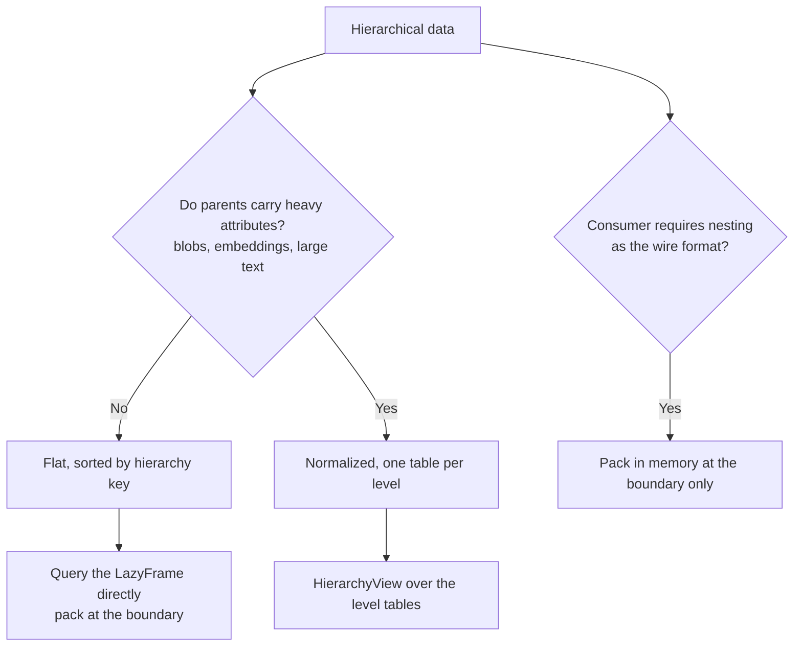

# Storage Layouts: Nesting Is a Compute Shape, Not a Storage Shape

`List[Struct]` is an excellent in-memory representation and a poor storage
representation. This page explains why, with measurements, and shows how
[`HierarchyView`](../api/view.md) lets you store data in a layout Parquet can
actually exploit while still programming against a nested interface.

!!! summary "The short version"
    Store your data **flat** or **normalized**. Pack it at the boundary where
    something actually consumes nesting. On a 2M-row three-level hierarchy,
    querying the packed Parquet file is **30–196× slower** than querying the
    same data stored flat — and the packed file is only ~15% smaller.

## What Parquet actually does with a nested column

A common assumption is that Parquet stores a `List[Struct]` as an opaque blob
and that nesting therefore forfeits columnar storage. That is **not** what
happens. Parquet uses Dremel record shredding: every leaf of a nested schema
becomes its own column chunk, at any depth. Packing a `region → store → sale`
hierarchy produces this footer:

```text
region.id                                     0.1 KB   minmax=yes
region.name                                   0.1 KB   minmax=yes
region.store[].id                             1.8 KB   minmax=yes
region.store[].name                           1.1 KB   minmax=yes
region.store[].sale[].id                    344.1 KB   minmax=yes
region.store[].sale[].amount                  4.0 KB   minmax=yes
region.store[].sale[].qty                     1.3 KB   minmax=yes
region.store[].sale[].sku                    16.9 KB   minmax=yes
region.store[].sale[].note                  217.6 KB   minmax=yes
```

Nine independent column chunks, each with its own encoding, compression and
min/max statistics, through two levels of list nesting. The bytes stay
columnar. So the problem is not the storage format.

## The three things you actually lose

### 1. Engines do not project into nested columns

Polars' Parquet reader projects at **top-level column** granularity. Asking for
one leaf reads all of them:

| Read one leaf (`sale.amount`, 0.7% of file bytes) | Time |
|---|---|
| nested layout | 71.2 ms |
| flat layout | **1.5 ms** |

This is not specific to lists — a plain `Struct{a, big}` behaves the same way
(13.0 ms for the whole column vs 13.8 ms for one field). It is an engine gap,
not a format limitation: pyarrow's low-level reader *can* do it
(`ParquetFile.read(columns=["region.store.list.element.sale.list.element.amount"])`
takes 4.1 ms vs 29.9 ms for all leaves). Note that pyarrow's **dataset**
scanner — the one with predicate pushdown — cannot, so this is not a gap you
can close simply by switching readers.

### 2. Row-group granularity collapses — this one is structural

A Parquet row group holds N **top-level** rows, and a list is never split
across one. The same 300k sales:

```text
flat.parquet     6 row groups × 50,000 rows
nested.parquet   1 row group  ×     20 rows
```

With the flat file, `filter(region.id == 3)` reports
`Predicate pushdown: reading 2 / 6 row groups` — real skipping. With the nested
file there is nothing to skip. Page indexes do not rescue this either:
`OffsetIndex.first_row_index` is a top-level row index, so even page-level
skipping stays at outer-row granularity.

**No reader improvement can fix this.** Row-group and page skipping is the main
reason Parquet is fast, and packing removes it.

### 3. No predicate pushdown into nested content

The filter lands above the scan, after `EXPLODE`/`UNNEST` — everything is
decoded, then discarded.

## Denormalizing is nearly free

The instinct to nest is usually about storage cost, and that instinct is wrong
here. Repeating parent columns across leaf rows costs almost nothing, because
RLE + dictionary encoding compresses them away — `region.id` repeated across
50,000 flat rows occupies **0.1 KB**:

| Layout | 300k rows | 2M rows |
|---|---|---|
| nested | 0.60 MB | 3.60 MB |
| flat | 0.65 MB (+8.7%) | 4.25 MB (+18.0%) |
| normalized (per level) | 0.67 MB (+11.8%) | 4.27 MB (+18.4%) |

You are trading ~10–18% of disk for one to two orders of magnitude of query
speed.

## Measured comparison

From `benchmarks/bench_storage.py`, 2M leaf rows, best of 3 (ms):

| Query | nested | flat | view | speedup |
|---|---|---|---|---|
| `root_key_filter` | 496.9 | **3.5** | 7.6 | 140.5× |
| `leaf_projection` | 465.2 | 5.4 | **4.6** | 101.1× |
| `leaf_filter` | 601.7 | **5.5** | 17.2 | 108.9× |
| `ancestor_attribute_filter` | 430.7 | **2.1** | 35.6 | 201.7× |
| `rollup_to_parent` | 692.3 | **26.1** | 31.0 | 26.5× |
| `existence` | 589.0 | **4.6** | 9.3 | 126.9× |
| `cross_level_predicate` | 568.7 | **8.1** | 57.4 | 70.0× |
| `materialize_nested` | 474.5 | 387.5 | **299.3** | 1.6× |
| `filtered_nested` | 595.9 | **38.3** | 55.9 | 15.6× |

Three results deserve comment:

- **`materialize_nested`** is the case nesting should win — and it does not.
  Reading the *already packed* file is the slowest of the three, because it has
  to decode every leaf through repetition/definition levels, while the other two
  stream plain columns and group them.
- **`ancestor_attribute_filter`** is where the normalized view pays for itself in
  reverse: answering it needs a semi-join that the flat layout gets for free by
  having every column on every row. This is the honest cost of normalization.
- **`rollup_to_parent` and `existence`** are where the *idiom* decides the cost,
  not the layout — see below.

### `level()` or `tables()`?

`level(g)` joins the whole root → `g` axis. The planner prunes ancestors you do
not read down to their key columns, so that is nearly free — but "nearly free"
is not "free", and a query that needs no ancestor column at all should not ask
for the join in the first place. `normalize()` puts every ancestor **key** on
the child table, so a roll-up keyed on the parent needs nothing else:

```python
# 31 ms — group the child's own table
view.tables()["sale"].group_by(view.key_columns("store")).agg(...)

# 76 ms — same answer, but joins region and store first for no reason
view.level("sale").group_by(view.key_columns("store")).agg(...)
```

The rule is simple: reach for `level(g)` when the expression mentions an
ancestor **attribute**, and `tables()[g]` when it only mentions keys.

Run it yourself:

```bash
python -m benchmarks.bench_storage --scale large --repeat 5
```

Every query is cross-checked across layouts before timing, so a divergence
fails the run rather than producing a suspiciously fast number.

## Which layout should you choose?



**Flat** is the default. Parent repetition is nearly free, every predicate gets
full pushdown, and no join is ever needed. Requires **no new API** — scan, filter
and select on the `LazyFrame`, then call `pack()` last:

```python
result = (
    pl.scan_parquet("sales.parquet")
    .filter(pl.col("region.id") == 3)          # row groups skipped here
    .select("region.id", "region.store.sale.amount")
)
nested = packer.pack(result, "region")          # nest only at the boundary
```

**Normalized** earns its keep when parents carry attributes you do not want
replicated across every leaf row — large blobs, embeddings, long text. That is
the same trade-off `pack(..., parent_strategy="split_join")` describes, applied
to storage instead of to a single operation.

**Nested on disk** is worth it only when the file is an interchange artifact
handed to a consumer that requires the nested shape and will read it whole.

## Using `HierarchyView`

`HierarchyView` gives the normalized layout a nested-looking interface. You
address columns by their dotted hierarchy path and never write a join.

```python
from nexpresso import HierarchicalPacker, HierarchyView

packer = HierarchicalPacker(spec)

# One-time conversion from whatever you have today.
HierarchyView.from_frame(flat_df, packer).sink_parquet("warehouse/")

# Every subsequent query scans one Parquet dataset per level.
view = HierarchyView.scan_parquet("warehouse/", packer)

hot = view.filter(pl.col("region.store.sale.amount") > 990)

hot.tables()["sale"]        # cheapest: no join, no nesting
hot.level("sale")           # a LazyFrame at leaf granularity — plain Polars from here
hot.nested().collect()      # the packed List[Struct] shape
```

### What the view does, and what Polars does

The view has two jobs: hand you a frame at the granularity you name, and
restrict the hierarchy consistently. Everything else is ordinary Polars on the
frame it returned.

| You write | What happens underneath |
|---|---|
| `level(g)` | Joins the root → `g` axis; the planner prunes ancestors you do not read down to their key columns |
| `level(g).with_columns(...)` | Nothing special — the ancestor columns are already on the frame |
| `level(child).group_by(view.key_columns(parent)).agg(...)` | A roll-up, at any depth: every level's table carries all of its ancestor keys |
| `level(parent).join(matching, how="semi")` | Existence, without explode or list construction |
| `filter` on a leaf attribute | Applied to that level's table |
| `filter` on an ancestor **key** | Applied to *every* table carrying it — sound transitive pushdown, so the deepest scan skips row groups with no join |
| `filter` on an ancestor **attribute** | Applied to the ancestor, then propagated by semi-join |
| `filter` spanning levels | Evaluated at the deepest level, ancestor columns joined in and dropped again |

The ancestor-key case is worth understanding, because it is free performance.
`normalize()` replicates ancestor **keys** into descendant tables as foreign
keys, so `region.id` exists on all three tables. A predicate on it can be
evaluated at the leaf directly:

```python
view.filter(pl.col("region.id") == 3).tables()["sale"]   # no join at all
```

### Empty-parent semantics

Filtering children changes which parents survive, and there are two defensible
answers. `HierarchyView` defaults to matching `pack()`:

```python
# 4 regions x 5 stores x 6 sales; the predicate matches in only 7 stores
view.filter(pl.col("region.store.sale.amount") > 15).nested().collect()
```

| `empty_parents` | Regions | Stores retained |
|---|---|---|
| `"prune"` (default) | 4 | 7 — matches `packer.pack()` exactly |
| `"keep"` | 4 | 20 — childless parents kept with empty lists |

Use `"keep"` when a parent row is meaningful even with no surviving children;
it also skips the upward semi-join cascade.

!!! note "Consistency is applied once, at materialization"
    Filtering one level implies restrictions on the others. `HierarchyView`
    defers both cascades — downward (children follow surviving parents) and
    upward (parents that lost every child disappear) — until you call a
    terminal method, and only for levels an operation actually restricted. An
    unfiltered view resolves to its scans with no joins added at all.

## What this does not solve

- **Existing nested files.** The view reads the normalized layout; converting
  costs one `from_frame(...).sink_parquet(...)` pass.
- **The projection gap on nested files.** Recovering that would need a
  pyarrow-backed scanner that reads individual leaf paths. It would help
  loss #1 but not loss #2, which is the dominant one.
- **Queries that genuinely need every column on every row.** The flat layout is
  simply better for those, and it is the recommended default.

## See also

- [`HierarchyView` API reference](../api/view.md)
- [Lazy Evaluation & Streaming](lazy-and-streaming.md) — which operations stream
  natively and which fall back to the in-memory engine
- `benchmarks/bench_storage.py` — the benchmark behind every number here
